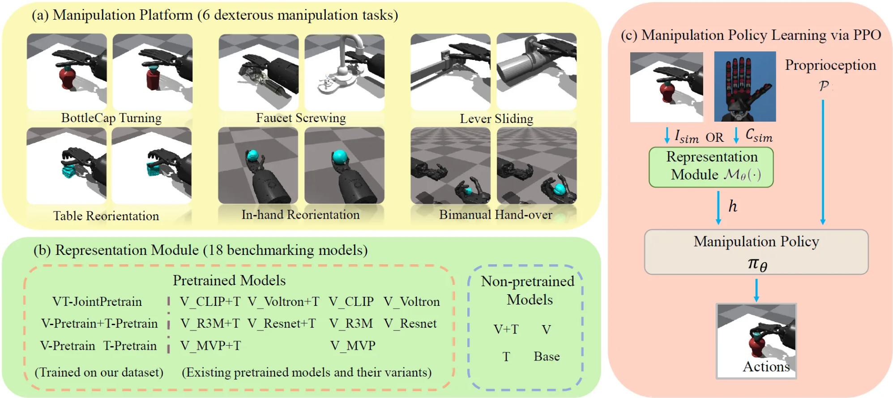

# VTDexManip: A Dataset and Benchmark for Visual-tactile Pretraining and Dexterous Manipulation with Reinforcement Learning

[Dataset](https://1drv.ms/f/c/9054151f0ba654c9/EslUpgsfFVQggJB7AQAAAAABJiaQQJwGSvDLSjEs1gS1og) ( password: ICLR2025 )               
[Pretraining models](https://github.com/kt0430/VTDexManipPretraining) ( using the dataset )

---

The repository is a benchmark for the study about visual-tactile dexterous manipulation, containing 6 complex dexterous manipulation tasks and 18 pretrained and non-pretrained models for evaluation.



# **Dependencies**

The code is tesed on Ubuntu 20.04 with Nvidia GeForce RTX 3090 and CUDA 11.4
- Create a conda environment and install  PyTorch

```bash
conda create -n vtdexmani python==3.8
conda activate vtdexmani
pip install torch==2.0.1 torchvision==0.15.2 torchaudio==2.0.2
```

- Install IsaacGym
    1. Download [isaacgym](https://developer.nvidia.com/isaac-gym/download)
    2. Extract the downloaded files to the main directory of the project
    3. Use the following commands to install isaacgym

```bash
  cd isaacgym/python
  pip install -e .
```

- Other Python packages can be installed by

```bash
pip install -r requirements.txt
```

# **VTDexManip** Benchmark

## Model list

- We construct 4 pretrained models and train these models with our dataset. We have relesesd the pretraining codes in the Github repository.
- We employ 5 common-used visual pretrained models: CLIP, R3M, MVP, Voltron and ResNet18 to construct 10 baseline models.
- There are 4 non-pretrained models.

| **Method** | **Modality** | **Pretrain** | **Joint pretrain** | **$model_name** |
| --- | --- | --- | --- | --- |
| VT-JointPretrain | v+t | ✔ | ✔ | vt_all_cls |
| V-Pretrain+T-Pretrain | v+t | ✔ | ✘ | vt_all_cls_sep |
| V-Pretrain | v | ✔ | - | vis_all_cls |
| T-Pretrain | t | ✔ | - | tac_all_cls |
| V-MVP | v | ✔ | - | v_mvp |
| V-Voltron | v | ✔ | - | v_voltron |
| V-R3M | v | ✔ | - | v_r3m |
| V-CLIP | v | ✔ | - | v_clip |
| V-ResNet | v | ✔ | - | v_resnet18_pre |
| V-MVP+T | v+t | ✔ | ✘ | vt_mvp |
| V-Voltron+T | v+t | ✔ | ✘ | vt_voltron |
| V-R3M+T | v+t | ✔ | ✘ | vt_r3m |
| V-CLIP+T | v+t | ✔ | ✘ | vt_clip |
| V-ResNet+T | v+t | ✔ | ✘ | vt_resnet18_pre |
| V+T | v+t | ✘ | - | vt_resnet18 |
| V | v | ✘ | - | v_resnet18 |
| T | t | ✘ | - | t_scr |
| Base | - | ✘ | - | base |

## Downstream tasks

| **Task** | **$task_name** |
| --- | --- |
| BottleCap Turning | bottle_cap |
| Faucet Screwing | screw_faucet |
| Lever Sliding | slide |
| Table Reorientation | reorient_down |
| In-hand Reorientation | reorient_up |
| Bimanual Hand-over | handover |

# Manipulation policy

## Pretrained model preparation

All pretrained models can be downloaded from [this url](http://jdias.com).

- Move the folder **“*pre_model_baselines*”** into the path **“*model/backbones”***
- Move the folder ***“model_and_config”*** into the path ***“model/vitac”***

## Training commands

In the root directory of the project, input the command to run training scripts:

```bash
# command template. If you want to visualize the tasks, remove "--headless" 
python train_agent.py --task {$task_name}-{$model_name} --rl_device {$device} --seed {$seed} --headless

#BottleCap Turning
python train_agent.py --task bottle_cap-vt_all_cls --rl_device cuda:0 --seed 111 --headless

#Faucet Screwing
python train_agent.py --task screw_faucet-vt_all_cls --rl_device cuda:0 --seed 111 --headless

#Lever Sliding
python train_agent.py --task slide-vt_all_cls --rl_device cuda:0 --seed 111 --headless

#Table Reorientation
python train_agent.py --task reorient_down-vt_all_cls --rl_device cuda:0 --seed 111 --headless

#In-hand Reorientation
python train_agent.py --task reorient_up-vt_all_cls --rl_device cuda:0 --seed 111 --headless

#Bimanual Hand-over
python train_agent.py --task handover-vt_all_cls --rl_device cuda:0 --seed 111 --headless
```

## Evaluation commands

In the root directory of the project, input the command to run evaluation scripts:

```bash
# command template. If you want to visualize the tasks, remove "--headless" 
python eval_agent.py --task {$task_names}-{$model_name} --rl_device {$device} --resume_model {$model_path}

# examples of BottleCap Turning, other tasks are similar
python eval_agent.py -task bottle_cap-vt_all_cls --rl_device cuda:0 --resume_model runs/BottleCap/bottle_cap/bottle_cap-vt_all_cls/seed111/checkpoint/model_2000.pt
```